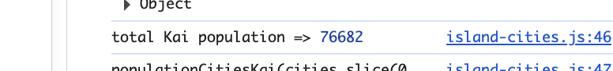

## TL;DR

I used to think “coding standards” meant bikeshedding about braces and spaces. After a week of ESLint + TypeScript and two WODs, I now think standards are *the shortest path to writing correct code faster*. The rules didn’t just format my code; they trained how I think.

---

## From “style police” to “thinking tool”

Before this week, style guides felt like dress codes: arbitrary rules enforced by tools. After chasing down ESLint errors in a time-boxed WOD, I realized most rules are little heuristics for better design:

- `prefer-const` nudged me to distinguish values from variables, which in turn made data flow clearer.
- `no-unused-vars` caught dead code early (often a sign my approach was drifting).
- Trailing commas / quote style weren’t about aesthetics; they reduced diff noise and made edits less error-prone.

The net effect: fewer distractions in the browser console, more focus on logic.

---

## WOD #1: *Baby Bieber*—small rules, big difference

The goal was to detect and count words (first “baby”, then “yeah”) **as whole words** without loops, using array/string functions. Two things stood out:

1. **Normalize before you match.**  
   A naïve `"baby" in string.includes` is wrong (“babysit” ≠ “baby”). Regex with word boundaries *almost* worked, but edge cases (punctuation, case) piled up. I ended up normalizing each line, converting non-letters to spaces, then splitting into tokens to avoid substring false positives.

   ```ts
   const normalized = line.replace(/[^a-zA-Z]/g, ' ').toLowerCase();
   const count = normalized.split(/\s+/).filter(w => w === 'yeah').length;
   ```

2. **Let the arrays do the looping.**  
   `some`, `filter`, and `reduce` read like *specifications*. ESLint’s “no loops” constraint nudged me toward clear, declarative solutions.

### Why this mattered

In a timed WOD, fewer moving parts = fewer bugs. Standards forced me to keep functions tiny and reusable: a predicate to check a token, a reducer to sum matches, and test lines that exercised both positive and negative cases (“yeah!” counts; “yeahs” does not).

---

## WOD #2: *Island Cities*—standards meet architecture

The second WOD raised the stakes: TypeScript data objects, per-island population totals, and the word to search was **“kai”** (substring, not whole word). A couple of lessons crystallized:

### 1) Normalize Hawaiian names

To be respectful and correct, matches should ignore macrons and the ʻokina. Normalization turned into a pattern I’ll reuse:

```ts
function normalizeHawaiian(s: string) {
  return s
    .normalize('NFD')
    .replace(/[\u0300-\u036f]/g, '') // strip combining marks (macrons, etc.)
    .replace(/\u02BB/g, '')          // remove ʻokina
    .toLowerCase();
}
const hasKaiInName = (name: string) => normalizeHawaiian(name).includes('kai');
```

### 2) DRY: one source of truth

The spec asked for both `hasKai` and `populationCitiesKai`. Instead of duplicating logic, I implemented `populationCitiesKai` first (filter by `hasKaiInName`, then `reduce` into an island→total map), and wrote `hasKai` as:

```ts
const hasKai = (list: City[]) => Object.keys(populationCitiesKai(list)).length > 0;
```

That’s DRY in action: fewer places bugs can hide.

### 3) Standards prevent gotchas—*before* runtime

I hit a classic TS error—**“Cannot redeclare block-scoped variable 'cities'”**—when I mixed a global `const cities` with a `declare const cities` in another file. The fix came from respecting **file roles** and **script load order**:

- Keep city data in `citiesf25.ts` as the single global `const`.
- Load scripts in HTML as **data first**, **functions second**.
- Don’t re-declare what already exists.

Boring? Maybe. Effective? Absolutely.

### 4) Edge cases are part of the standard

The assignment explicitly asked for empty arrays and missing island data. My reducer buckets those into `"Unknown"`:

```ts
const island = c.island && c.island.trim() ? c.island : 'Unknown';
```

I also added `console.assert` checks (sum should be **76682** for “kai”) to catch regressions fast. Little tests, big confidence.

```html
<p class="text-center">
   76682"
       loading="lazy">
</p>
```

---

## ESLint: painful, useful… mostly useful

Was it frustrating to rerun `npx tsc` only to be scolded about a trailing comma? Yep. But that friction is short-term. In both WODs, the *real* time sinks were logic bugs and architecture hiccups—ESLint pushed those problems to the surface earlier.

My takeaways:

- **Turn the linter from judge into coach.** Fix the rule once, learn the lesson, move on.
- **Automate**: run ESLint/TS watch so feedback is continuous, not a last-minute pile-on.
- **Let rules shape design**: small pure functions, explicit types, reuse helpers, test edge cases.

---

## A tiny checklist I’m keeping

- Normalize → then match (especially with natural language).
- Prefer `const`; make mutation explicit when it’s truly needed.
- Build with `map`/`filter`/`reduce` first; reach for loops only when necessary.
- One file owns a global; other files *consume* it—don’t redeclare.
- DRY by composition: write the more general function first; derive the boolean helper from it.
- Add a couple of `console.assert`s for invariants (cheap guardrails).

---

## Closing thought

Coding standards are not about making the code look pretty; they’re about making *thinking* predictable. In both WODs, the standards reduced choices, which reduced bugs, which reduced stress. That’s a trade I’ll take every week.

---

## AI use disclosure

I used AI (ChatGPT) to **brainstorm edge cases**, **improve comment clarity**, and **double-check ESLint/TypeScript error meanings**. I did **not** ask AI to write the solutions end-to-end or the essay text wholesale; the code and narrative reflect my own approach and voice. Where AI suggested corrections (e.g., handling ʻokina/macrons, avoiding global redeclaration), I reviewed and adapted them.