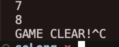
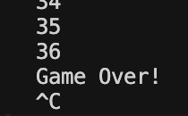
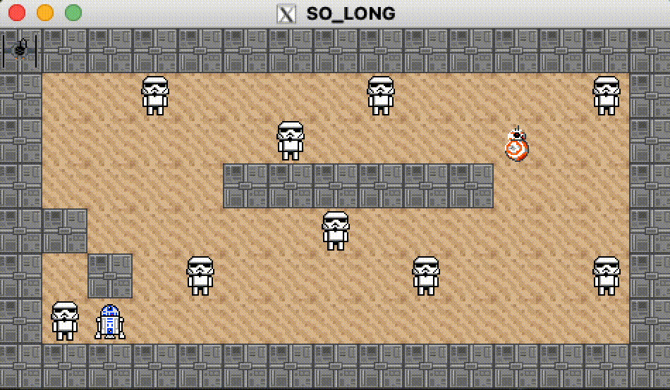
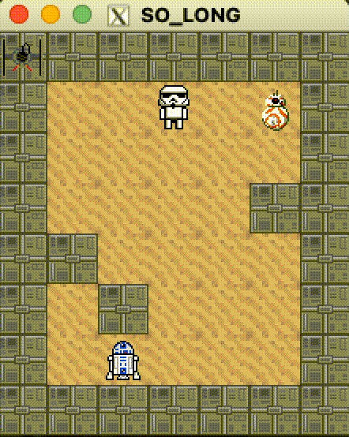

## TL;DR

I built a tiny 2D maze game in C using MiniLibX. You “clear” every **C** (Stormtrooper) by touching it, then reach **E** (R2-D2) to win—while an enemy chases you. The full source is here: **[koi-ama/so_long](https://github.com/koi-ama/so_long)**.

- Engine: C + MiniLibX (X11), pixel tiles, 4-frame sprites  
- Assets: simple XPM sheets I drew (player, enemy, walls, floor, item, exit)  
- Environment: Linux dev container; Makefile builds MLX + game

## What the game looks like

  
*Made it to R2-D2 after clearing the board.*

  
*…and this is what happened the first few tries.*

## Two short clips (why I tweaked the map)

**First try (too difficult):**



**Second try (friendlier layout, finally clear):**




I initially built a map that looked clever in my head and felt miserable under my fingers. After a few “boom” moments, I simplified the corridors and spacing. Practicing on a friendlier layout helped me learn the feel of movement and timing—then I could come back to harder maps with less panic.

## The rules (my flavor)

- **P** = the player (a small cat sprite).  
- **C** = *Stormtrooper*. Touch it to “clear” it from the map.  
- **E** = *R2-D2*. Reach him **after** the board is cleared to win.  
- There’s also a single **chaser** that moves toward you each turn.  
- The map is validated at startup: closed by walls, exactly one P/E, ≥1 C, and everything reachable.

Under the hood it’s standard *so_long*, just with my playful theme. (Icons are my custom XPMs for personal learning use.)

## A tiny slice of code

The enemy is greedy: each step it picks the direction that **reduces the Manhattan distance** to the player. I also added a tiny throttle so it doesn’t move *every* time you do, which buys you a beat to route around it.

```c
// Trimmed for the article; see repo for full version.
void enemy_controller(t_game *g) {
  static const int dx[] = {0, 0, 1, -1};
  static const int dy[] = {1, -1, 0, 0};

  // cheap throttle: skip sometimes so the chase has rhythm
  if ((g->moving * g->player_x) % 5 == 0) return;

  int best = 0, bestDist = INT_MAX;
  for (int d = 0; d < 4; d++) {
    int ny = (g->enemy_y + dy[d] + g->map_height) % g->map_height;
    int nx = (g->enemy_x + dx[d] + g->map_width)  % g->map_width;
    int dist = abs(ny - g->player_y) + abs(nx - g->player_x);
    if (dist < bestDist) { bestDist = dist; best = d; }
  }
  g->enemy_y = (g->enemy_y + dy[best] + g->map_height) % g->map_height;
  g->enemy_x = (g->enemy_x + dx[best] + g->map_width)  % g->map_width;
}
```

That `%` wraparound creates fun edge teleports on some layouts—one more little thing to plan around.

## Pixel art & animation: small loops, big feel

I drew six XPMs (player/enemy/wall/floor/item/exit). Each sprite sheet is 32×32 tiles; the player and enemy have **4 frames**. I blit a 32-pixel-wide window along the sheet as the frame counter advances. Transparency is handled by skipping a sentinel color (e.g., `0xFF000000`) when writing to the frame buffer, so the character blends neatly over the floor.

Short version: tiny frames + consistent timing = surprisingly lively motion, even with four frames.

## My build setup

Inside a **Linux Dev Container** so compilers and X11 deps are consistent:


- `Makefile` builds **libft**, **minilibx**, then the game.
- Keybinds: `W/A/S/D` to move, `Esc` to quit.
- It’s X11/MiniLibX, so target is Linux.

Run it like this:

```bash
# Clone and build MLX + libft + game
git clone https://github.com/koi-ama/so_long
cd so_long
make mlx
make

# Play one of the maps
./so_long ./map.ber
```


## What I’d like to try next

- Smarter chasing (e.g., BFS/A* occasionally, or a “patrol” mode).  
- A built-in map editor (draw walls and export `.ber`).  
- Little sound cues for pickup, exit open, and the “oh no it’s on me” moment.

## Repo & credits

- Source: **[koi-ama/so_long](https://github.com/koi-ama/so_long)**  
- Sprites: my own XPMs; playful nods to a galaxy far, far away (e.g., R2-D2 for the exit).  
- Made for learning; not an official game or asset pack.

